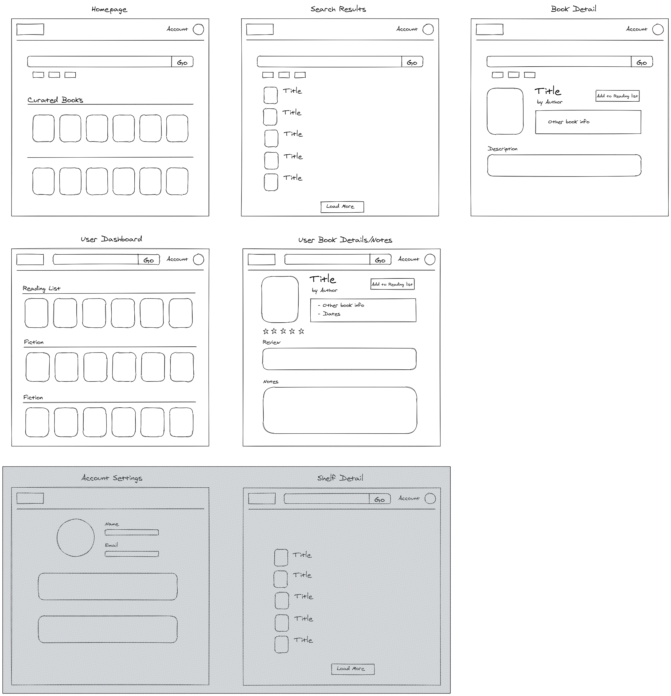

OpenShelf is an online bookshelf app that replicates some of the features of Goodreads. The app is built with Next.js, Firebase, and TailwindCSS. It uses Google and GitHub social auth for user management and provides a simple note-taking interface with Slate.js.

## Learn More

## Deploy on Vercel

The easiest way to deploy your Next.js app is to use the [Vercel Platform](https://vercel.com/import?utm_medium=default-template&filter=next.js&utm_source=create-next-app&utm_campaign=create-next-app-readme) from the creators of Next.js.

Check out our [Next.js deployment documentation](https://nextjs.org/docs/deployment) for more details.
