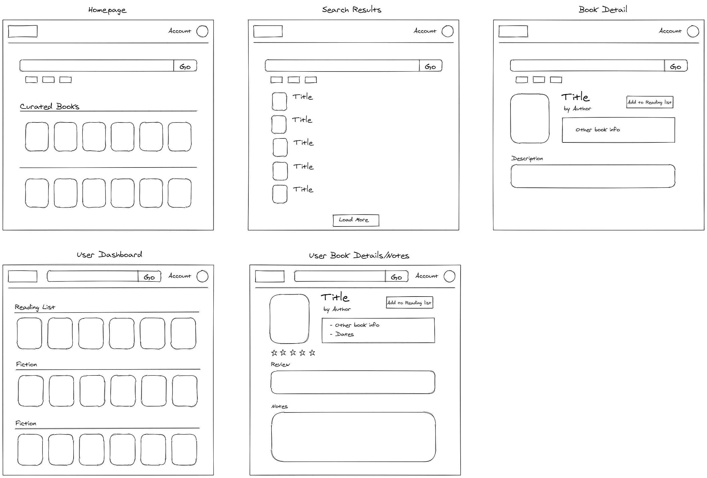

# OpenShelf

OpenShelf is an online bookshelf app that replicates some of the features of Goodreads. The app is built with Next.js, Firestore, and TailwindCSS. It uses Google and GitHub social auth for user management and provides a simple note-taking interface with Slate.js.

[Live Demo](https://openshelf.vercel.app)

## Initial App Mockup

These diagrams were created using [Excalidraw](https://excalidraw.com/), a full-featured and privacy-focused virtual whiteboard.

## Tech Stack

After using Next.js to build a few static sites, I wanted to try using it to build a more dynamic web app. The goal was to combine Next.js' static and server-rendered approaches to create a performant app. However, since the book data is fetched from the OpenLibrary API, I didn't have a use case for employing `getStaticProps` or `getStaticPaths`. Even so, it's nice that the hybrid nature of Next.js allows you to build apps almost like you would a regular React app. 

One hiccup with Next.js that tripped me up is that you cannot pass props through their built-in router, like you are able to with React Router. Instead, their suggested approach is to make new fetch requests from the component that needs the data, either in static props, server-side props, or client-side fetching. Static and server-side data fetching are meant for more static data, like blog posts, not dynamic data such as fetching a user's books and notes. Thus, you have to do that fetch on the client-side when the app rehydrates. I found that approach awkward because it is inefficient to fetch data so many times when in a React Router app, I could simply pass that data through the router. An improvement would be to use a state management library, like Redux or even React Context. Next.js also offers SWR, which is similar to React-Query, to cache the results of your data fetch so that subsequent fetches first look in the server cache for data and only revalidate that data when the cache is stale.

I chose Firestore as my backend and database because my data model is not relational, and I wanted to have access to the real-time features of the database. Also, Firebase Authentication is included for free and handles many types of authentication methods. Using the whole Firebase ecosystem allowed me to build fast and also secure users' data with Firestore security rules. For future projects though, I would most likely go back to using PostgreSQL for the database because I found querying Firestore to be too simplistic. 

For the app styling, I used TailwindCSS because I like the core principles of the project. Instead of having separate CSS files and coming up with specific names for each element, I can apply the utility styles directly to my components. Tailwind also works really well with the component-based approach to applications of React. Styles within an encapsulated component are reused anywhere the component is used, so I only had to style a component once and was able to reuse them in other areas of the app.

## OpenLibrary API

The core feature of my app, finding books and their descriptions, is built using the generous [OpenLibrary API](https://openlibrary.org/developers/api). They provide access to their entire catalog of books through this API and even offer a bulk download of their records. I made use of the Search API to find a list of books, the Works API to get details about a specific book, and the Covers API to generate the book thumbnails and cover images.

One issue I had with OpenLibrary is that searching for a book may bring up several editions of the same book - which are essentially duplicates in my app. The differences between these books are the different publishers, editions, but they all have different IDs, so a search will retrieve them all. 

At first, I considered using the Google Books API, but I had seen some users talk about rate limiting of their API. Also, one feature I want to add is the ability to find similar books by genre, and the Google Books API has no ability to query for books based on a subject or category. It seems there are some copyright laws surrounding books and lists, like the New York Times Bestsellers, that prevent them from offering this API. Luckily, OpenShelf has an experimental Subjects API that allows for just that - searching for books by subject. 

## Future Improvements

- Filter out duplicate books (different editions) that match a certain criteria - perhaps by matching book titles.
- Add search for books by subjects. Need to pair with some other search term, because default data returned is not filtered.
- Add more editing options to the Slate.js note editor.